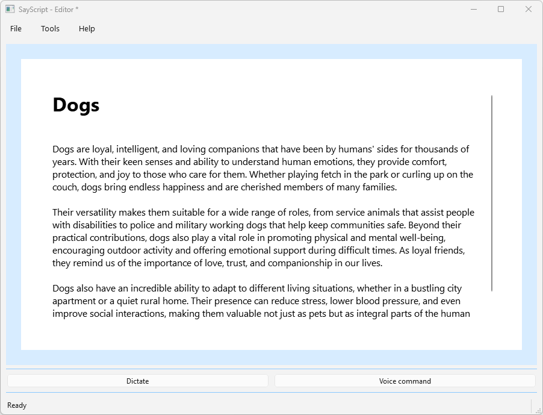
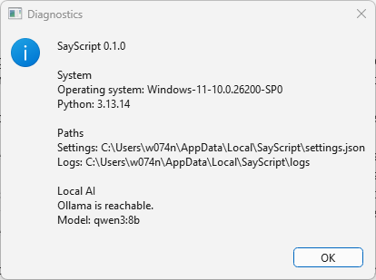

# SayScript

SayScript is a local AI-assisted text editor with dictation, voice commands, and text generation through a locally running LLM. 

The application is built with Python and PySide6. It supports classic text editing, speech-to-text dictation, voice-controlled commands, local AI text generation and transformation, PDF export, printing, localization, logging, diagnostics, document autosave and recovery and configurable settings.

## Project Goal

SayScript was created as a practical desktop application and portfolio project. 
The goal is to demonstrate software development skills in a realistic application context by creating something useful:

* desktop GUI development with PySide6
* modular Python architecture
* local AI integration through Ollama
* speech recognition with faster-whisper
* command parsing for typed and spoken commands
* settings management
* localization
* logging and diagnostics
* packaging preparation for Windows and Linux
* unit tests for core logic

## Features

* Rich text editor based on QTextEdit
* Dictation through microphone input
* Separate mode for voice commands
* Local LLM integration through Ollama
* AI text generation
* AI text transformation for selected text
* Continue existing text with AI
* German and English interface language
* German and English text generation language
* File support for TXT, HTML, and Markdown
* PDF export
* Print support
* Voice commands for common editor actions
* Configurable Ollama model and endpoint
* Configurable speech recognition settings
* Platform-aware settings paths for Windows and Linux
* Rotating log file
* Diagnostics dialog
* Configurable document autosave and recovery
* Word count and document statistics
* Unit tests for command parsing

## Technology Stack

* Python
* PySide6
* Ollama
* faster-whisper
* sounddevice
* pytest
* PyInstaller

## Architecture Overview

SayScript is organized into separate modules for UI, command routing, AI access, speech recognition, settings, localization, logging, and platform-specific paths.

```text
main.py
  └── MiniEditor / main_window.py
        ├── CommandRouter
        ├── LlmClient
        ├── LlmWorker
        ├── AudioRecorder
        ├── SpeechWorker
        ├── SettingsDialog
        ├── localization
        ├── platform_paths
        └── logging_setup
```

### Main Components

| Component                 | Responsibility                                    |
| ------------------------- | ------------------------------------------------- |
| `main_window.py`          | Main GUI, editor, menus, dialogues, file handling |
| `command_router.py`       | Parses typed and spoken commands                  |
| `llm_client.py`           | Communicates with Ollama                          |
| `llm_worker.py`           | Runs AI tasks outside the UI thread               |
| `speech/recorder.py`      | Records microphone input                          |
| `speech/transcriber.py`   | Transcribes audio with faster-whisper             |
| `speech/speech_worker.py` | Runs transcription outside the UI thread          |
| `settings.py`             | Loads and saves application settings              |
| `settings_dialog.py`      | GUI for editing settings                          |
| `localization.py`         | Provides translated UI strings                    |
| `locales/de.py`           | German command aliases, prompts, and messages     |
| `locales/en.py`           | English command aliases, prompts, and messages    |
| `platform_paths.py`       | Provides Windows/Linux-compatible app paths       |
| `logging_setup.py`        | Configures rotating log files                     |

## Local AI and Privacy

SayScript is designed to work with local AI models through Ollama.
Text generation and transformation can run locally, depending on the installed Ollama model.

This means text does not need to be sent to a cloud service for AI processing.

The current default model `qwen3:8b` can be reconfigured in the settings dialog.

## Requirements

* Python 3.11 or newer recommended
* Ollama installed and running locally
* An installed Ollama model, for example `qwen3:8b`
* Microphone access for dictation and voice commands
* System with 16 GB RAM for the default`faster-whisper` and `qwen3:8b` configuration. 

A dedicated graphics adapter with at least 8 GB VRAM is recommended for better performance, but not required. 


## Installation

### Windows

```powershell
python -m venv .venv
.\.venv\Scripts\activate
pip install -r requirements.txt
python main.py
```

### Linux

```bash
python3 -m venv .venv
source .venv/bin/activate
pip install -r requirements.txt
python main.py
```

Alternatively, use the helper script:

```bash
chmod +x run_linux.sh
./run_linux.sh
```

On Linux, additional system packages may be required for audio input, Qt, or printing, depending on the distribution.

### Local AI Models

Ollama can be downloaded here: [Ollama](https://ollama.com). We recommend using the `qwen3:8b` model, which can be installed and started like this:

```text
ollama run qwen3:8b
```

SayScript connects to Ollama through the configured local endpoint, by default:

```text
http://localhost:11434
```

During first time usage, the default speech recognition model `faster-whisper` medium 8bit will be downloaded in the background after the first voice input. Its size is roughly around 800 MB. 

### Linux audio notes

SayScript uses `sounddevice` for microphone input.  
On some Linux distributions, PortAudio may need to be installed separately.

Debian/Ubuntu example:

```bash
sudo apt install portaudio19-dev
```

Microphone permissions and the active audio system, for example PulseAudio or PipeWire, may also affect recording.

## Build

SayScript includes PowerShell and bash build scripts for creating a Windows  or Linux `onedir` release with PyInstaller.

### Windows onedir build

Make sure the virtual environment is active and all dependencies are installed:

```powershell
.\.venv\Scripts\activate
pip install -r requirements.txt
```

Then run:

```powershell
.\build.ps1
```

The build output is created in:

```text
dist\SayScript
```

The executable is:

```text
dist\SayScript\SayScript.exe
```

### Linux onedir build

A Linux build must be created on Linux.

```bash
chmod +x build_linux.sh
./build_linux.sh
```

The build output is created in:

```bash
dist/SayScript
```

The executable is:

```bash
dist/SayScript/SayScript
```

The `onedir` build keeps the application executable and its required runtime files together in one folder. This makes the build easier to inspect, test, and distribute than a single-file executable during development.

### Build artifacts

Generated build folders such as `build` and `dist` should usually not be committed to Git. They can be recreated from the source code and the build script.

## Tests

SayScript includes unit tests for the command routing logic.

The tests check that typed or spoken commands are mapped to the correct internal actions, for example:

* German commands
* English commands
* text generation commands
* search and replace commands
* PDF export command
* print command
* diagnostics command
* regression tests for ambiguous commands

The tests intentionally avoid the real GUI, Ollama, and microphone input.
This keeps the core command parsing logic fast and reliable to test.

Run tests:

```powershell
python -m pytest
```

## Logging

SayScript writes a rotating log file.

Typical log entries include:

* application startup
* settings changes
* file open/save events
* PDF export
* printing
* diagnostics
* errors with stack traces

Log files are stored in a platform-aware location.

### Windows

```text
%LOCALAPPDATA%\SayScript\logs
```

### Linux

```text
~/.local/state/sayscript/logs
```

## Settings Paths

SayScript stores settings in platform-aware locations.

### Windows

```text
%LOCALAPPDATA%\SayScript\settings.json
```

### Linux

```text
~/.config/sayscript/settings.json
```

## Voice Commands

Examples of supported German commands:

```text
fett
kursiv
speichern
schriftgröße 42
liste
überschrift 1
öffne einstellungen
exportiere als pdf
drucken
diagnose
über sayscript
generiere einen text über hunde
suche nach hund
ersetze hund durch katze
```

Examples of supported English commands:

```text
bold
italic
save
font size 47
list
heading 1
open settings
export as pdf
print
diagnostics
about sayscript
generate a text about dogs
search for dog
replace cat with dog
```

## Current Status

SayScript is under active development.

Implemented:

* editor UI
* dictation
* voice commands
* local LLM integration
* PDF export
* printing
* settings dialog
* localization
* logging
* diagnostics
* command router tests
* Windows/Linux path abstraction
* word count and document statistics
* autosave and recovery
* Windows onedir build script
+ The build script uses the PyInstaller configuration from `SayScript.spec`.

Planned:

* optional DOCX export

## Screenshots

### Main editor



### Settings


### Local AI diagnostics



## License

SayScript is licensed under the Apache License 2.0.

See the `LICENSE` file for details.

Third-party dependencies keep their own licenses. Additional dependency notices are documented in `THIRD_PARTY_NOTICES.md`.

SayScript does not bundle Ollama models or Whisper model files. Users are responsible for installing and using models according to the respective model licenses.

## Author

Created as a portfolio project for demonstrating practical Python desktop application development, local AI integration, speech recognition, and maintainable application architecture.
